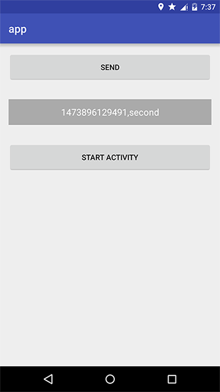
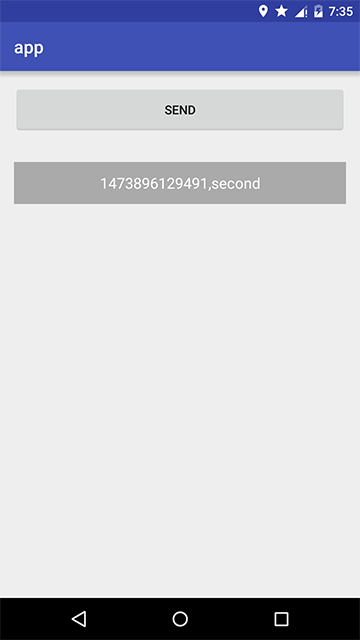

RxBusDemo
=
The demo of RxBus.

Use
-
* 1:register and unregister 
protected void onResume() {
    super.onResume();
    rxbus.register(EventType.NOTICE, this);
}
 
protected void onDestroy() {
    rxbus.unregister(EventType.NOTICE, this);
    super.onDestroy();
}

* 2:send event 
rxbus.send(EventType.NOTICE, System.currentTimeMillis()+",Hello World");

* 3:Monitor event method 
public void onRxEvent(EventType type,Object content){
    // 
}

Add RxBus to your project
-
Copy the java file in the rxbus package.

screenshot
-

